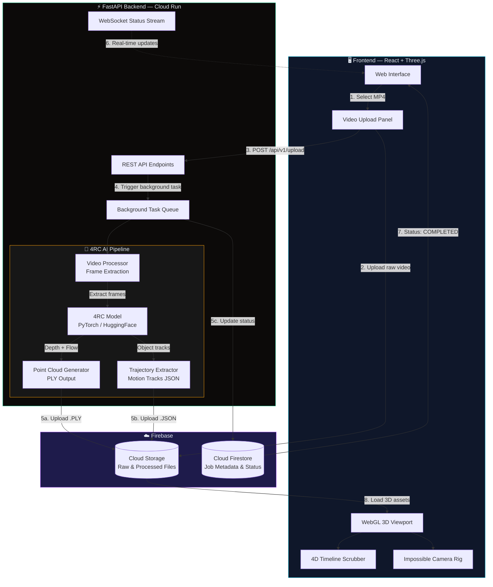

<p align="center">
  
</p>

<h1 align="center">🛸 The Impossible Drone Camera</h1>
<h3 align="center">4D Spatial Reconstruction via Conditional Querying (4RC)</h3>

<p align="center">
  <em>Transform standard drone footage into interactive 4D point clouds. Click any moving object. Fly alongside it.</em>
</p>

<p align="center">
  <a href="https://react.dev/"></a>
  <a href="https://threejs.org/"></a>
  <a href="https://tailwindcss.com/"></a>
  <a href="https://fastapi.tiangolo.com/"></a>
  <a href="https://pytorch.org/"></a>
  <a href="https://firebase.google.com/"></a>
  <a href="https://cloud.google.com/vertex-ai"></a>
  <a href="https://www.docker.com/"></a>
</p>

---

## 🎯 What Is This?

**The Impossible Drone Camera** is a full-stack AI application that takes standard monocular drone video and reconstructs it into an interactive **4D point cloud** (3D + Time). Powered by the **4RC** (4D Reconstruction via Conditional Querying) model, users can:

- 🔬 **Explore** dense 3D reconstructions of real-world drone footage
- 🎯 **Click** on any moving object (car, bike, pedestrian, drone) to isolate its trajectory
- 🎥 **Shift perspective** — mount a virtual camera onto any tracked entity and experience the scene from its viewpoint
- ⏱️ **Scrub through time** — drag the timeline to examine any moment from any angle

---

## 🏗️ System Architecture



---

## 🛠️ Technology Stack

| Layer | Technologies | Role |
|:---|:---|:---|
| **Frontend Visualizer** | React 19, Vite, Three.js (raw WebGL), Tailwind CSS 4, Framer Motion, Lucide Icons | Premium dark UI, dense 4D point cloud rendering, perspective-shift camera interpolation |
| **Backend API** | Python 3.10+, FastAPI, Uvicorn, Pydantic v2, WebSockets | REST + WebSocket API, async video processing orchestration |
| **AI Engine** | PyTorch, 4RC Model (`Luo-Yihang/4RC`), OpenCV, NumPy, SciPy | 4D reconstruction: depth estimation, point cloud generation, motion trajectory extraction |
| **BaaS & Realtime** | Firebase Admin SDK, Cloud Firestore, Firebase Storage | File storage (raw video, processed PLY/JSON), real-time job status streaming |
| **Infrastructure** | Google Cloud Run, Docker, Cloud Pub/Sub | Serverless container deployment, event-driven processing triggers |

---

## 📂 Project Structure

```text
the-impossible-drone-camera/
├── src/                          # Vite + React Frontend
│   ├── components/
│   │   └── ThreeCanvas.tsx       # WebGL 3D point cloud viewport
│   ├── hooks/
│   │   └── useVideoProcessing.ts # Upload → Process → Poll lifecycle
│   ├── lib/
│   │   ├── api.ts                # Backend API client
│   │   └── firebase.ts           # Client-side Firebase SDK
│   ├── App.tsx                   # Main dashboard hub
│   ├── data.ts                   # Tracked objects & environment data
│   ├── types.ts                  # TypeScript interfaces
│   └── index.css                 # Tailwind directives
│
├── backend/                      # Python FastAPI Backend
│   ├── app/
│   │   ├── api/
│   │   │   ├── routes.py         # REST endpoints (upload, process, status)
│   │   │   └── schemas.py        # Pydantic request/response models
│   │   ├── core/
│   │   │   ├── config.py         # Environment settings (Pydantic BaseSettings)
│   │   │   └── logging.py        # Structured logging
│   │   ├── services/
│   │   │   ├── firebase_client.py # Firebase Admin SDK wrapper
│   │   │   └── storage.py        # Local filesystem fallback
│   │   ├── ai_pipeline/
│   │   │   ├── inference.py      # 4RC model loading & inference
│   │   │   ├── video_processor.py     # OpenCV frame extraction
│   │   │   ├── point_cloud_generator.py # Depth → PLY conversion
│   │   │   ├── trajectory_extractor.py  # Motion track compilation
│   │   │   └── pipeline.py       # End-to-end orchestration
│   │   └── main.py               # FastAPI app bootstrap
│   ├── tests/                    # pytest test suite
│   ├── Dockerfile
│   ├── docker-compose.yml
│   └── requirements.txt
│
├── package.json
├── vite.config.ts
├── index.html
└── README.md
```

---

## 🚀 Getting Started

### Prerequisites

| Tool | Version | Required For |
|:---|:---|:---|
| **Node.js** | v18+ | Frontend dev server |
| **Python** | 3.10+ | Backend API server |
| **CUDA GPU** | Compute 7.0+ | 4RC model inference (optional: CPU fallback available) |
| **Docker** | 20.10+ | Containerized deployment |
| **Firebase CLI** | Latest | Firebase project setup |

### 1. Clone the Repository

```bash
git clone https://github.com/Paramveersingh-S/4D-Spatial-Reconstruction.git
cd 4D-Spatial-Reconstruction
```

### 2. Frontend Setup

```bash
npm install
npm run dev
```
The React visualizer boots at [http://localhost:3000](http://localhost:3000).

### 3. Backend Setup

```bash
cd backend

# Create virtual environment
python -m venv .venv
source .venv/bin/activate    # Linux/Mac
# .venv\Scripts\activate     # Windows

# Install dependencies
pip install -r requirements.txt

# Configure environment
cp .env.example .env
# Edit .env with your Firebase credentials and settings

# Run the FastAPI server
uvicorn app.main:app --reload --host 0.0.0.0 --port 8000
```

The API is live at [http://localhost:8000](http://localhost:8000). Interactive docs at [http://localhost:8000/docs](http://localhost:8000/docs).

### 4. Docker (Full Stack)

```bash
cd backend
docker-compose up --build
```

---

## 🔑 Environment Variables

| Variable | Description | Default |
|:---|:---|:---|
| `GOOGLE_CLOUD_PROJECT` | GCP project ID | `impossible-camera-dev` |
| `FIREBASE_CREDENTIALS_PATH` | Path to Firebase Admin SDK JSON | `firebase-adminsdk.json` |
| `FIREBASE_STORAGE_BUCKET` | Firebase Storage bucket name | `impossible-camera-dev.appspot.com` |
| `MODEL_DEVICE` | PyTorch device (`cuda` or `cpu`) | `cuda` |
| `MODEL_NAME` | Hugging Face model identifier | `Luo-Yihang/4RC` |
| `MAX_UPLOAD_SIZE_MB` | Maximum video upload size | `50` |
| `CORS_ORIGINS` | Allowed CORS origins (comma-separated) | `http://localhost:3000` |
| `LOG_LEVEL` | Logging level | `INFO` |
| `USE_LOCAL_STORAGE` | Use filesystem instead of Firebase | `false` |

---

## 📡 API Endpoints

| Method | Endpoint | Description |
|:---|:---|:---|
| `GET` | `/` | Health check |
| `GET` | `/api/v1/health` | Detailed system health |
| `POST` | `/api/v1/upload` | Upload raw MP4 video |
| `POST` | `/api/v1/process/{video_id}` | Trigger 4RC reconstruction |
| `GET` | `/api/v1/status/{video_id}` | Get job processing status |
| `GET` | `/api/v1/results/{video_id}` | Fetch processed assets (PLY + JSON URLs) |
| `GET` | `/api/v1/jobs` | List all reconstruction jobs |
| `DELETE` | `/api/v1/jobs/{video_id}` | Delete a job and its assets |
| `WS` | `/api/v1/ws/status/{video_id}` | WebSocket real-time status stream |

---

## 🧪 Testing

```bash
cd backend

# Run all tests
pytest tests/ -v

# Run with coverage
pytest tests/ -v --cov=app --cov-report=html

# Run specific test suites
pytest tests/test_api.py -v        # API endpoint tests
pytest tests/test_pipeline.py -v   # AI pipeline tests
pytest tests/test_integration.py -v # End-to-end tests
```

---

## 🐳 Deployment (Google Cloud Run)

```bash
# Build and push container
gcloud builds submit --tag gcr.io/$PROJECT_ID/impossible-camera-backend

# Deploy to Cloud Run
gcloud run deploy impossible-camera-backend \
  --image gcr.io/$PROJECT_ID/impossible-camera-backend \
  --platform managed \
  --region us-central1 \
  --memory 8Gi \
  --cpu 4 \
  --gpu 1 \
  --timeout 600 \
  --set-env-vars "MODEL_DEVICE=cuda,FIREBASE_STORAGE_BUCKET=your-bucket.appspot.com"
```

---

## 📜 License

This project is licensed under the Apache License 2.0. See [LICENSE](LICENSE) for details.

---

<p align="center">
  <strong>Built with 🔬 by <a href="https://github.com/Paramveersingh-S">Paramveer Singh</a></strong>
  <br/>
  <sub>Powered by 4RC • React 19 • Three.js • FastAPI • Firebase • Google Cloud</sub>
</p>
